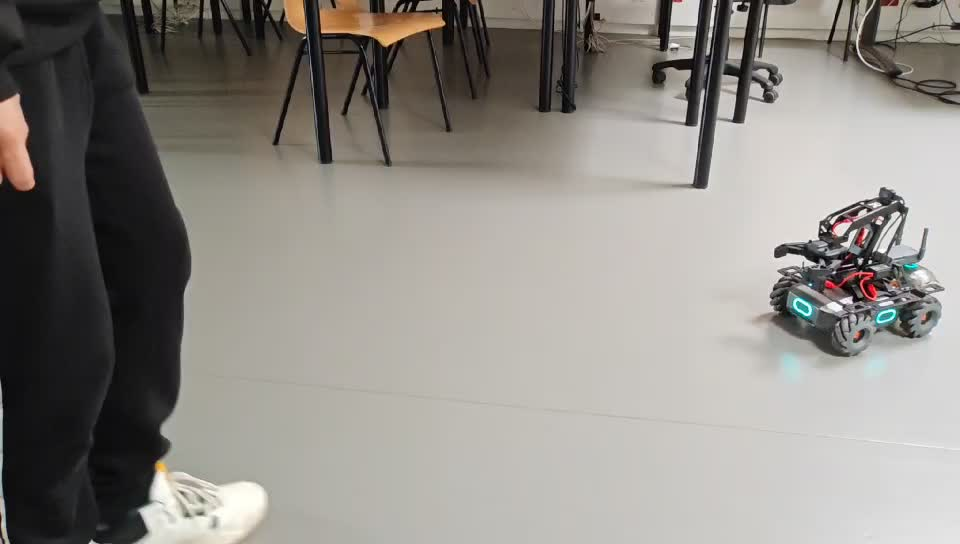

---

# DJI Robomaster 项目

这是一个基于 DJI Robomaster 的机器人控制项目，结合了 MediaPipe 和 PID 控制器，实现在小车上的避障、人体跟踪和抓取功能。项目代码已托管在 GitHub 上。

## 目录

- [简介](#简介)
- [功能](#功能)
- [安装](#安装)
- [使用指南](#使用指南)
- [项目结构](#项目结构)
- [演示视频](#演示视频)
- [贡献](#贡献)
- [许可证](#许可证)
- [联系方式](#联系方式)

## 简介

本项目旨在通过 DJI Robomaster 实现智能机器人功能。使用 MediaPipe 进行人体跟踪，利用 PID 控制器实现精确的控制和避障功能。

## 功能

- **避障**：通过传感器数据实时检测障碍物并避开它们。
- **人体跟踪**：使用 MediaPipe 检测和跟踪人的位置。
- **抓取**：实现机器人手臂的控制以完成抓取任务。

## 安装

### 必要的软件和库

确保你的系统上安装了以下软件和库：

- Python 3.x
- OpenCV
- MediaPipe
- NumPy
- DJI SDK

### 克隆项目

```bash
git clone https://github.com/17662153280/DJI-Robomaster.git
cd DJI-Robomaster
```


## 使用指南

### 配置

1. 配置 DJI SDK，确保你的机器人可以连接到你的计算机。
2. 配置 MediaPipe 模型和相关参数。

### 启动程序

根据你的需要运行以下脚本：

- **避障功能**：`python obstacle.py`
- **人体跟踪**：`python body-pid.py`
- **抓取功能**：`python grab.py`

### 示例命令

```bash
python main.py --mode obstacle
```

## 项目结构

```
DJI-Robomaster/
│
├── obstacle.py     # 避障功能脚本
├── body-pid.py         # 人体跟踪功能脚本
├── grab.py               # 抓取功能脚本
├── README.md                 # 项目的 README 文件
└── LICENSE                   # 项目许可证
```

## 演示视频
```
点击下方缩略图观看演示视频：


[点击这里观看视频](/video/跟踪2.mp4)


```


## 贡献

欢迎贡献代码、提出问题或进行改进。请遵循以下步骤：

1. Fork 这个项目。
2. 创建一个新的分支：`git checkout -b feature-branch`
3. 提交你的更改：`git commit -am 'Add new feature'`
4. 推送到分支：`git push origin feature-branch`
5. 提交 Pull Request

## 许可证

这个项目使用 [MIT 许可证](LICENSE) 进行许可。

## 联系方式

如有问题或建议，请通过以下方式联系我：

- **邮箱**：yaobing202402@sina.com
- **GitHub**：[@17662153280](https://github.com/17662153280)

---

记得根据你的实际情况和项目细节调整 README 文件的内容！如果你有更多具体要求或其他需要补充的部分，请告诉我。
